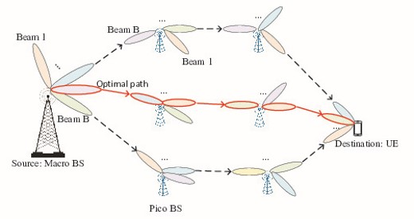

My research is on interactive machine learning (ML), where learning agents actively engage in data collection to make decisions or gain useful insights. Such interactive nature of learning processes enables learning agents to focus on collecting data from the relevant parts of the environment, thus allowing to save data collection effort (which oftentimes translates to onerous human labor or experimental cost). My reserach goal is to understand and establish principled ways to design interactive machine learning algorithms with efficiency guarantees (e.g. sample efficiency, computational efficiency), and evaluate them experimentally in simulated and real-world datasets and environments. Here are some research topics I have been working on: 

### Imitation Learning

Imitation learning (IL), or Learning from Demonstrations, models the setting where a learning agent learns from a demonstrating expert to obtain intelligent sequential decision making behavior. Compared with reinforcement learning, imitation learning has the advantages that: (1) it gets around the reward misspecification problem and (2) it can mitigate the challenge 
of exploration. Such paradigm has been successfully deployed in e.g. robotics and autonomous driving. [My research](https://arxiv.org/abs/2312.16860) [in imitation learning](https://arxiv.org/abs/2209.12868) has been focused on understanding the power of interactive expert demonstrations: if we have an expert that can provide real-time, interactive action demonstration (cf. offline IL with expert demonstration trajectories readily available), how can we best utilize it and save its effort? 

    <!-- First Column -->
    

        
         
        
    

    <!-- Second Column -->
    

        
         
        
    

### Exploration in Bandits and Reinforcement Learning

    <!-- First Column -->
    

    
    

    

    A wide range of sequential decision making problems require learning agents to perform exploration to learn about relevant parts of the environment. E.g., a robot needs to traverse a part of the maze before it finds way to its goal; a product recommendation system might want to gather information about a user's interest by trying to suggest users products they may 
    like and see their reactions. My research in this area has been on understanding how to perform efficient exploration in structured environments, e.g., in the presence of [large](https://arxiv.org/abs/1902.01520) [action](https://arxiv.org/abs/2006.06040) [spaces](https://link.springer.com/chapter/10.1007/978-3-031-26412-2_17), [multi-task](https://arxiv.org/abs/2010.15390) [settings](https://arxiv.org/abs/2107.08622), [structured reward distributions](https://arxiv.org/abs/2304.14989), and environments with [sparsity](https://arxiv.org/abs/2210.15345) and [low-rank](https://arxiv.org/abs/2402.11156) properties. 
    

### Active Learning

Although in many applications of ML, unlabeled examples are abundant and easy to obtain, obtaining label annotations can be very time- and labor-consuming. Active learning aims at using interaction to reduce label annotation efforts: by adaptively making label queries to experts, the learning agent can avoid making queries on examples whose labels they are confident about and thus focus on querying informative examples. My research aims at designing principled approaches for active learning with label requirements approaching fundamental information-theoretic limits, ensuring [computational efficiency](https://arxiv.org/abs/2102.05312) [and noise tolerance](https://arxiv.org/abs/2002.04840), as well as [practical heuristics](https://arxiv.org/abs/1906.03671). I am also interested in the interplay of active learning with other fields, such as [uncertainty](papers/easydata_crp.pdf) [quantification](https://arxiv.org/abs/1407.2657), [fairness estimation](https://arxiv.org/abs/2206.08450), and [game theory](https://openreview.net/forum?id=s5hSp7EdL3). 

### Multi-task and Transfer Learning

Real-world learning agents are not just trained and tested on one task; they usually learn and act in many different tasks at the same time, borrowing the insights they learn from one task for better learning in other ones. This is especially relevant in the modern foundation model era, where the ``pretrain-then-finetune'' paradigm becomes standard. My research tries to quantify when and how one can utilize auxiliary source of data to provably benefit learning and decision making, tailored to settings such as [active learning](https://arxiv.org/abs/1510.02847), [contextual bandits](https://arxiv.org/abs/1901.00301), [multi-task](https://arxiv.org/abs/2206.08556) and [meta-learning](https://openreview.net/forum?id=2kZMtdjzSV).  

### Interdisciplinary Collaborations

Besides machine learning methodology research, I am also interested in working with domain experts on tailoring general methods to practical applications. This includes the efforts of: developing large-action-space bandit algorithms for [beam and](https://link.springer.com/chapter/10.1007/978-3-031-26412-2_17) [path selection](http://wiser.arizona.edu/papers/zhao-mass2024-tech-report.pdf) in wireless communication; designing [fairness-aware bandit algorithms for network coexistence](https://ieeexplore.ieee.org/abstract/document/10579843/); interpretable classification for [oracle cancer detection](https://www.mdpi.com/2072-6694/15/5/1421), and [lens design starting point generation using LLMs](https://repository.arizona.edu/handle/10150/675276?show=full). 

  
   

